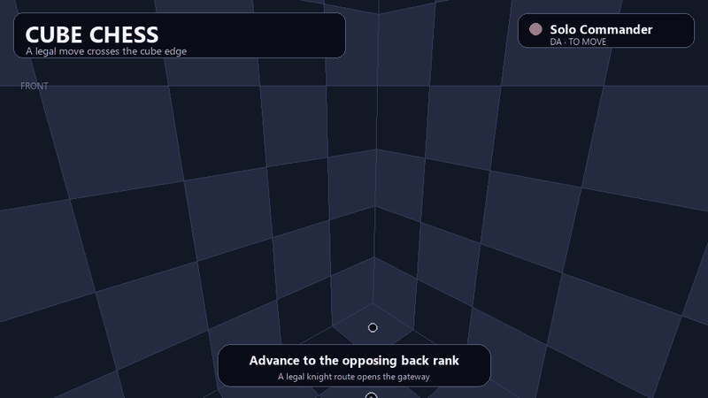

# Cube Chess

Cube Chess is a 3D chess variant played across all six faces of a cube, with wraparound movement and support for 2–12 players, including the 4-player Free-4-All, 6-player Hex Havoc, 8-player Octa-Brawl, 10-player Deca-Clash, and 12-player Mindfield free-for-all modes.

> **License:** This project is source-available and publicly viewable for evaluation, education, and personal non-commercial use only. Commercial licensing is available on request. See [LICENSE.md](LICENSE.md).

## Demo



The highlighted knight follows a legal engine-validated move sequence, becomes gateway-ready on the opposing back rank, and climbs from the floor to the right face.

### Extended gameplay overview

https://github.com/user-attachments/assets/6c9bcb9b-c2cd-405b-ba79-03a9bd205e7a

## Features

- Full 3D rendering from inside the cube.
- An 8×8 board on each of the cube's six faces.
- Straight and diagonal movement across connected edges after a piece advances through its gateway and becomes cube-enabled.
- Standard two-player chess and Cube Chess modes for 2–12 players.
- Configurable CPU opponents, including matches with zero to twelve CPU-controlled seats.
- Standard-mode draw detection for threefold repetition, the 50-move rule, stalemate, and insufficient material.
- Spectator Mode with pause, single-step, pace, and CPU-style controls, allowing enthusiasts and chess players to observe matches and study play.
- An API for external agentic AI, human, CPU, and server-hosted GPU-agent play using REST and WebSocket connections.
- Support for experiments in which GPU and hardware developers can connect agents that compete using their own inference systems.
- A future goal of holding a Cube Chess Master Tournament for agentic AI and other AI systems. The tournament and any associated prizes have not been implemented.

## How to Run

The browser game uses native JavaScript modules and a small Node.js server. The optional authoritative agent API uses Python, FastAPI, and SQLite. There is no browser compilation or bundling step.

### Browser game

Install Node.js 18 or newer, then run:

```powershell
npm start
```

Open `http://127.0.0.1:4173/` in a browser. The 3D renderer is loaded from a public CDN, so the first page load requires an internet connection.

### Agent API

Install Python 3.11 or newer. From the repository directory, run:

```powershell
python -m pip install -r requirements-api.txt
python -m cube_chess_api.cli create-key --label local-owner
npm run api
```

The API starts at `http://127.0.0.1:8000/`, and its interactive API documentation is available at `http://127.0.0.1:8000/docs`. Run `npm start` in a second terminal to use the 3D browser client with an API match.

To verify the project:

```powershell
npm test
npm run check:browser
```

## Rules

Standard mode follows traditional one-versus-one chess on a single floor plane. In Cube Chess modes, every army begins in a traditional formation on its home face. Pieces initially remain on that plane and cannot wrap across an edge. A piece that reaches the opposing back rank becomes gateway-ready; on a later turn it may climb through that edge, become cube-enabled, and continue legal straight or diagonal movement across connected cube faces.

A pawn promotes to a Queen, Rook, Bishop, or Knight when it reaches the opposing far edge on its home face. Standard castling and en passant are implemented on the starting plane. Castling across cube edges and cross-edge en passant are not currently implemented.

## Status

Cube Chess is actively in development. Feedback and playtesters are welcome.

## Contact

For commercial licensing, publishing, or partnership inquiries, contact RJaloudi@gmail.com.
